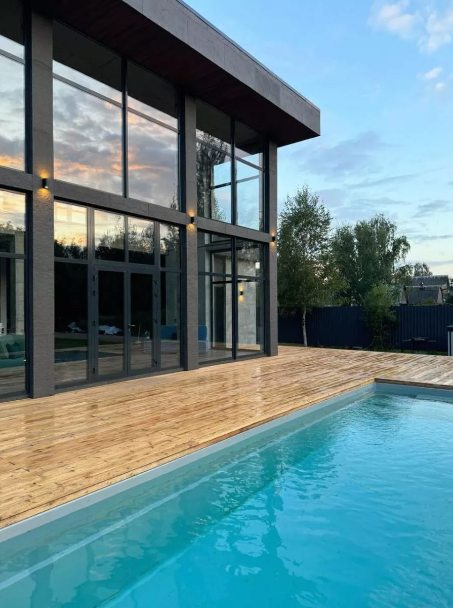
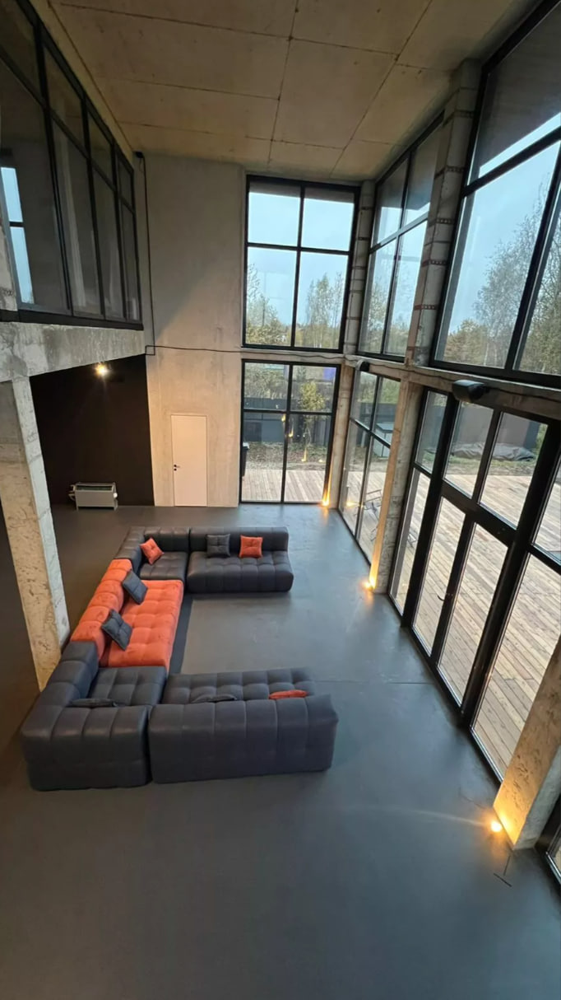
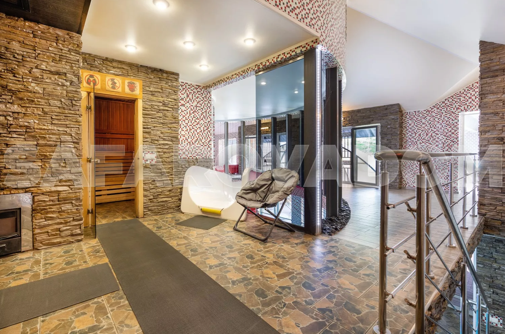
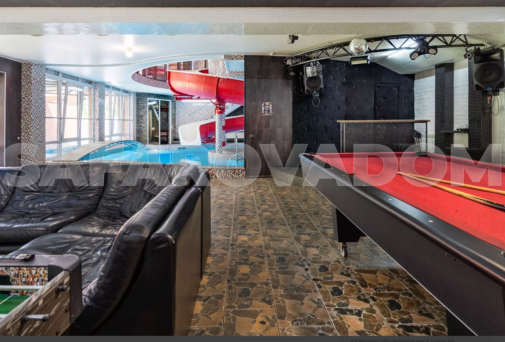

1. [Банкетный](https://vidnoye.cian.ru/rent/suburban/316676663/)

155к, ехать: 50мин
1000кв. м, 3 этажа

	На первом этаже находится банкетный зал 150 кв.м в дворцовом стиле, танцпол, полностью оборудованная кухня столовая ( имеется вся необходимая техника и посуда), спальня, 2 санузла. На втором этаже 8 уютных спален, санузел, джакузи. На третьем этаже кальянная, бильярд, комната отдыха с панорамным видом ( + дополнительные спальные места). На цокольном этаже бассейн с подсветкой подогревом (4х5 м.), финская сауна, комната для отдыха, санузел. На всем этаже полы с подогревом.

2. [Молодежный](https://safarovadom.com/catalog/18/)

\
200к, ехать: 55мин
500кв. м, 2 этажа
дом ОЧЕНЬ красивый, басик с подогревом на улице (омерикан вайб). Минус что с 9 нельзя шуметь на улице (ака у басика).
 Можно например тусить на первом этаже (панорамные окна на басик), и немного в бассейне (но без шума)

	В доме 6 спален, в том числе мастер-спальня с ванной и панорамным видом на лесную чащу и бассейн  
9 мини спален  
покерная игровая комната  
сауна на каменной финской печи  
профессиональное музыкальное оборудование с качественным звуком и простым подключением.  
  На просторной террасе 140 м2 расположен бассейн с круглогодичным подогревом.

4. [Красная горка](https://safarovadom.com/catalog/10/)
  
  
	200к, ехать: 50мин
550кв. м, 3 этажа
бильярд хоккей, караоке, аквапарк, баня, ночной клуб
Тут оч круто что сквозь дом горка в басик (который по середине дома). И в целом дом оч классный

	
	  Сцена оборудована акустикой 1,5кВт и осветительными приборами.
   Спальни изолированные 9 -шт.
   Санузлы 5-шт.
   Душевая 2-шт.
   Барбекю с мангалом внутри на 25 человек.
   Бассейн 6*12м, часть которого выходит на территорию участка разделяющего запорной балкой. Внутри основного бассейна джакузи с горячей водой.
   Русская баня на дровах 3,5*6м.
   Караоке с бильярдным залом (американка), санузлом, 2-мя кухнями, душевой, комнатой отдыха возле сауны.
   Водная горка со 2-го этажа 18 метров.
5. [Парадайс](https://shchyolkovo.cian.ru/rent/suburban/249009643/)
	
	
	[3D обзор](https://vrtours.one/virtual_tours/lofthouse21/)
	150к, ехать: 45мин
700кв. м, 2 этажа
Дом с 7го парадайса, очень концентрированное место, есть ВОЛЕЙБОЛ и ПОКЕР

	Дом двухэтажный с 12 тью спальнями. Комфортное размещение до 30 ти человек. На первом этаже находится бассейн размером 5х7 метров , глубиной 145-175 см. Сауна со стеклянной стеной видом на бассейн. Два душа. Два санузла . Барная стойка 4 метра длиной и открытый кухонный остров с духовкой , варочной панелью и раковиной. Два больших обеденных стола. Игровая зона с большим телевизором и консолью PlayStation. Мощный профессиональный музыкальный центр управляемый через Bluetooth, с возможностью подключения любого диджейского пульта. 4 спальные комнаты. Гардероб. На втором этаже находятся 8 спален, 2 санузла и душем. Открытый второй свет с видом на бассейн. Комната для кальяна. Выход на открытую уличную террасу размером 20х4 метра с великолепным видом на карьеры и лес.

6. [Белый дом](https://mytishchi.cian.ru/rent/suburban/316749082/)
	
	
	120к, ехать: 20мин
900кв. м, 3 этажа
фруктовый садик, мангал, аэрохоккей, бильярд, караоке, сауна
	
	бассейн в доме 5х2,5 ( включен в стоимость) -финская сауна. 
	Отдельный СПА-комплекс бассейн 8х4 ( за дополнительную плату 5000) финская сауна 
	Уютная территория с фруктовым садиком, беседкой и площадкой для выездных регистраций и проведения церемоний. 
	Крытый мангал.

7. [Пятницкое](https://mosarend.ru/map/arenda-kottedzhei/kottedzh-na-50-chelovek-406.html)
	
	
	100к, ехать: 60мин
1000кв. м, 4 этажа
Беседка, бильярд, приятная территоррия, настольный теннис, камин, караоке, прудик. Самый недорогой дом. Просторный, оч приятный
Минусы: дизайн а-ля королевский кринж

	Цокольный этаж: бассейн 7х4 с подсветкой и подогревом, финская сауна, зона отдыха в восточном стиле, русский бильярд 8ф. Санузел с душем.  
1 этаж: Банкетный зал 100 м2 с камином и аквариумом. Гостиная 50 м2. Кухня со всей необходимой посудой и техникой. Санузел.  
2 этаж: 4 спален, с/у.  
3 этаж: зона отдыха, 3 спальни.
